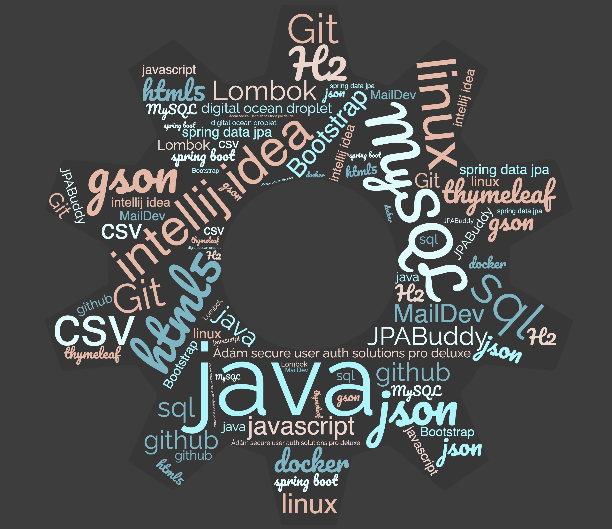

# Carnivora saját projekt
A Projekt célja egy <strong>leszármazotti függőségeket tartalmazó adatstruktúra modell </strong>bemutatása, a <strong>ragadozók</strong> kladisztikus osztályozási módszerének példáján keresztül. Az adatstruktúra kezelést és megértését <strong>interaktív genogrammal (kladisztikus genetikai családfa)</strong>, illetve további adminisztrációs felületekkel és funkciókkal szemlélteti.
### Az alábbi ábra mutatja az entitásokat és azok között fennálló kapcsolatokat:

### Fejlesztői környezet:

